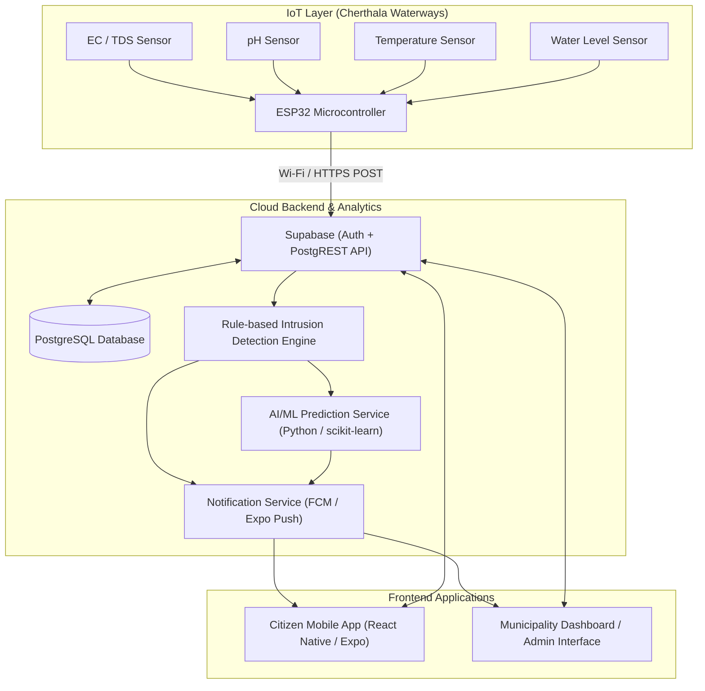

# Cherthala Water Watch — Complete Implementation Roadmap

> **IoT + Mobile App + Municipality Grievance System + AI/ML**
>
> Smart system that continuously monitors water quality, detects saline water intrusion, predicts intrusion risk, alerts citizens and authorities, provides live & historical visualizations, and allows citizens to register and track grievances.

---

## 1. Technology Stack

| Layer | Technologies |
|---|---|
| **Mobile App** | React Native (0.86), Expo SDK 57, Expo Router, React Native Reanimated |
| **Backend / Auth / DB** | Supabase (PostgreSQL, Auth, Row-Level Security) |
| **IoT Hardware & Firmware** | ESP32 Microcontroller, Wi-Fi / HTTP / MQTT |
| **Sensors** | Electrical Conductivity (EC / TDS), pH sensor, Temperature (DS18B20), Ultrasonic Water Level (HC-SR04 / JSN-SR04T) |
| **Machine Learning** | Python, scikit-learn, Random Forest classifier/regressor |
| **Push Notifications** | Firebase Cloud Messaging (FCM) / Expo Push Notifications |
| **Location & Maps** | GPS / Station latitude & longitude coordinates |

---

## 2. System Architecture



---

## 3. Sensor Parameters & Rationale

| Parameter | Unit | Target / Normal | Role in Saline Intrusion Detection |
|---|---|---|---|
| **Electrical Conductivity (EC)** | µS/cm | < 1,500 µS/cm | **Primary indicator** for dissolved mineral salts and saline intrusion from backwaters/sea. |
| **Total Dissolved Solids (TDS)** | ppm (mg/L) | < 500 ppm | Supporting indicator of dissolved inorganic salts; mathematically related to EC. |
| **pH Level** | pH (0–14) | 6.5 – 8.5 | General water health indicator and supporting feature for ML; not a standalone salinity metric. |
| **Water Level** | Meters | Tidal variation | Tracks tidal flow and backwater surges that drive saltwater inland into freshwater canals. |
| **Water Temperature** | °C | 25°C – 32°C | Essential for temperature-compensating EC/pH sensor readings and environmental modeling. |

---

## 4. Suggested Database Schemas

### SensorReading
```typescript
interface SensorReading {
  _id: string;
  timestamp: string;      // ISO 8601 string or Date
  stationId: string;      // e.g., 'ST-001'
  ec: number;             // Electrical Conductivity (µS/cm)
  tds: number;            // Total Dissolved Solids (ppm)
  ph: number;             // pH (0–14)
  temperature: number;    // °C
  waterLevel: number;     // Meters
}
```

### MonitoringStation
```typescript
interface MonitoringStation {
  id: string;             // e.g., 'ST-001'
  name: string;           // e.g., 'Vembanad Lake Inlet (North)'
  location: string;       // e.g., 'North Cherthala'
  coordinates: {
    lat: number;
    lng: number;
  };
  isActive: boolean;
  installedAt: string;
}
```

### Complaint
```typescript
type ComplaintStatus = 'Submitted' | 'Under Investigation' | 'Action Taken' | 'Resolved';

interface Complaint {
  id: string;
  userId: string;
  category: 'Saline Intrusion' | 'Water Quality' | 'Infrastructure' | 'Flooding';
  description: string;
  photo?: string | null;
  location: string;
  coordinates?: { lat: number; lng: number };
  status: ComplaintStatus;
  statusHistory?: Array<{ status: ComplaintStatus; note: string; timestamp: string }>;
  createdAt: string;
  updatedAt: string;
}
```

### Prediction
```typescript
type RiskLevel = 'Low' | 'Moderate' | 'High' | 'Critical';

interface Prediction {
  stationId: string;
  timestamp: string;
  riskProbability: number;   // 0.0 to 1.0 (0% - 100%)
  riskLevel: RiskLevel;
  predictionHorizon: string; // '24h' | '48h' | '7 days'
  factors?: string[];
}
```

---

## 5. Mobile App Features & Structure

### Citizen Mobile App
- **Splash Screen**: Animated water droplet branded splash.
- **Authentication**: Citizen login and registration (JWT-based).
- **Home Dashboard**:
  - Saline intrusion risk gauge & status pill.
  - Current station water quality metrics (EC, TDS, pH, Temp).
  - Quick station selector and risk distribution.
  - AI intrusion forecast summary.
- **Live Monitoring Screen**:
  - Multi-station selector (`ST-001`, `ST-002`, `ST-003`).
  - Real-time gauge and metric breakdown with safety thresholds.
  - Signal status and GPS coordinates.
- **Complaints & Grievances**:
  - Timeline of filed complaints with live status tracking (`Submitted` → `Under Investigation` → `Action Taken` → `Resolved`).
  - Interactive complaint submission modal with category, description, and location tag.
- **Profile & Settings**:
  - User details & notification preferences.
  - Theme customizer: Dark mode, Light mode, or System default.
  - App version and municipal contact info.

### Municipality / Admin Interface
- **Admin Dashboard**: Overview of all monitoring stations in Cherthala taluk.
- **Intrusion Alerts**: Real-time alerts when sensor readings cross critical thresholds.
- **Grievance Management**: Assign officers, add investigation notes, update status, and close complaints.
- **Data Export & Reports**: CSV/PDF generation for municipal water board meetings.

---

## 6. IoT Data Flow

```
[Sensors: EC, pH, Temp, Level]
        ↓
    [ESP32 ADC / I2C / OneWire]
        ↓
    [Wi-Fi / Cellular Modem]
        ↓ HTTP POST /api/sensor/readings
    [Supabase (PostgREST API)]
        ↓
    [PostgreSQL Storage]
        ↓
    [Rule-Based Threshold Engine + ML Service]
        ↓
    [Push Notification Dispatch & Live WebSockets/Polling]
        ↓
    [Citizen & Municipality Apps]
```

---

## 7. Machine Learning Pipeline

```
Historical Sensor & Environmental Data (Rainfall, Tides, Temp, EC)
        ↓
Data Cleaning (Outlier rejection, sensor drift correction)
        ↓
Feature Engineering (Rate of EC change, 6h/12h moving average, tidal phase)
        ↓
Train / Test Split (Time-series split)
        ↓
Model Training (Random Forest Classifier / Regressor, XGBoost)
        ↓
Model Evaluation (Precision, Recall, ROC-AUC for high-salinity events)
        ↓
Live Prediction REST Endpoint (POST /api/ml/predict)
        ↓
Risk Level / Probability → Mobile App Display
```

---

## 8. Development Roadmap

```mermaid
graph LR
    P1["Phase 1: Simulation (Wokwi ESP32)"] --> P2["Phase 2: Supabase + PostgreSQL"]
    P2 --> P3["Phase 3: Mobile App Polish"]
    P3 --> P4["Phase 4: Physical Sensor Hardware"]
    P4 --> P5["Phase 5: Alerts & Grievance Pipeline"]
    P5 --> P6["Phase 6: Historical Data Collection"]
    P6 --> P7["Phase 7: ML Intrusion Model"]
    P7 --> P8["Phase 8: Municipal Integration"]
```



1. **Phase 1 — Simulation**: Wokwi ESP32 simulation emitting simulated EC/TDS, pH, temperature, and water level readings.
2. **Phase 2 — Backend**: Supabase project with PostgreSQL tables, Row-Level Security policies, and Auth for stations, readings, and complaints.
3. **Phase 3 — Mobile App**: Complete screens, integrate REST endpoints, state management, and offline cache.
4. **Phase 4 — Physical Sensors**: Calibrate physical probes with standard buffer solutions and deploy ESP32 field units.
5. **Phase 5 — Alerts & Grievance**: Push notifications when thresholds breach; live grievance lifecycle tracking.
6. **Phase 6 — Historical Dataset**: Continuous logging of backwater salinity variations across seasonal changes.
7. **Phase 7 — ML Prediction**: Train Random Forest model on historical salinity + weather + tidal data.
8. **Phase 8 — Final Municipal Deployment**: Field testing with local Cherthala authorities.
